B.Sc. Engg. Thesis

STUDENT RECORD MANAGEMENT SYSTEM

Department of Computer Science & Engineering

(In partial fulfillment of the requirements for the degree of

Bachelor of Science in Computer Science & Engineering)

Department of Computer Science & Engineering

Bangladesh University of Business & Technology (BUBT)

Dhaka 1000

February 24, 2021 

**Acknowledgment** 

We would like to pay our gratitude to the Almighty Allah who created us with all the abilities to understand analysis and develop the process with patience. We are thankful to our thesis supervisor  Meer  Muttakin  Alam,  Assistant  Professor,  Computer  Science  and  Engineering Department, Bangladesh University of Business and Technology for his professional guidance and motivation during the work of this thesis which is a major part of it. Without his valuable support and guidance, this thesis could not reach this level of development from our point of view. 

We would like to thank all the Faculty members, Department of CSE, Bangladesh University of Business and Technology for their valuable time spend in requirements analysis and evaluation of the thesis work. We would like to express our sincere and warm gratitude to all those who have  encouraged  us  directly,  provided  mental  encouragement  and  criticized  our  work  in several phases during the development of this thesis and for preparing this thesis 

indirectly. 

**Abstract** 

Working with big data faces different issues but the most important issues are the security of the data and the processing time or power. This study aimed at establishing, improving the Student Records Management System in Bangladesh University of Business and Technology. Specifically, this study required to find the data collection of student records in Bangladesh University of Business and Technology, to improve on the impact of information protection of student  records,  and  finally,  it  was  done  to  establish  the  improvement  of  computerized information  management  of  student  Records  in  Bangladesh  University  of  Business  and 

Technology. The finding shows that data collection at BUBT currently uses manual that is to say form filling, verbal, and later kept manually or in files. The researcher suggests that further research should be conducted in departments at BUBT students collect different information and store it in places such as recruitment and others. *BigchainDB*. 

**Declaration** 

We hereby declare that the Thesis on Comparison Based studies to Secure Data for Numerical Network Prediction using Blockchain submitted in partial fulfillment of the requirements for the  degree  of  Bachelor  of  Science  in  Computer  Science  and  Engineering  of  Bangladesh University of Business and Technology (BUBT) is our own work and that it contains no material which has been accepted for the award to the candidate(s) of any other degree or diploma, except where due reference is made in the text of the project. To the best of our knowledge, it contains no materials previously published or written by any other person except where due reference is made in the project. 

————————————  ————————————  ———————————— Nazmul Islam Emon  SM Raziur Rahman Pushon  Nushrat Jahan Liza 

ID: 19202103240  ID: 19202103214  ID: 19202103235 

**Copyright** 

© Copyright by Sm Raziur Rahman Pushon (19202103214), Nazmul islam Imon (19202103240) and Nusrat jahan Liza (19202103235).

All Right Reserved.

**Dedication** 

*Dedicated to our parents, teachers, friends and who loved us for all their love*

*and inspiration.*

**Certificate** 

This is to certify that Nazmul Islam Imon(ID-19202103240), Sm Raziur Rahman Pushon(ID- 19202103214),  Nusrat  Jahan  Liza  (ID-19202103235),  belonged  to  the  Department  of Computer Science and Engineering, have completed their Thesis on Comparison Based studies to Secure Data for student record management system in partial fulfillment for the requirement of  Bachelor  of  Science  in  Computer  Science  and  Engineering  of  Bangladesh  University  of Business and Technology in the year 2021. 

———————————————————————— Supervisor  

Meer Muttakin Alam 

Assistant Professor 

Department of Computer Science and Engineering Bangladesh University of Business and Technology 

**Approval** 

A Thesis on Comparison Based studies to Secure Data for Numerical Network Prediction using Blockchain  is  submitted  by  Sm  Raziur  Rahman  Pushon(ID-19202103214),  Nazmul  Islam Imon(ID-  19202103240),  Nusrat  Jahan  Liza  (ID-19202103235)  under  the  department  of Computer Science and Engineering of Bangladesh University of Business and Technology is accepted in partial fulfillment of the requirements for the degree of Bachelor of Science in Computer Science and Engineering 

————————————————————————— Chairman 

Prof. Dr. M. Ameer Ali 

Professor and Chairman 

Department of Computer Science and Engineering Bangladesh University of Business and Technology 

————————————————————————— Supervisor 

Mr. Atanu Shome 

Assistant Professor 

Department of Computer Science and Engineering Bangladesh University of Business and Technology 

**Acronyms List** 

RSA = Rivest–Shamir–Adleman 

DAO = Decentralized Autonomous Organization 

DES = Data Encryption Standard 

USD = United State Dollar 

UK = United Kingdom 

IPFS = Inter Planetary File System 

IoT = Internet of Things 

IBM = International Business Machines Corporation SSL = Secure Sockets Layer 

AML = Anti-Money Laundering 

KYC = Know Your Customer 

TiM = Trust in Motion 

MIT = Massachusetts Institute of Technology 

ASX = Australian Securities Exchange 

JPX = Japan Exchange Group 

IPO = Initial Public Offering 

QR = Quick Response Code 

MD5 = Message-Digest Algorithm 

MAC = Message Authentication Codes 

BTC = Bitcoin 

NIST = National Institute of Standards and Technology GCD = Greatest Common Divisor 

AES = Advanced Encryption Standard TLS = Transport Layer Security 

vi 

VPNs = Virtual Private Network 

ECC = Elliptic Curve Cryptography 

DDoS = Distributed Denial of Service 

URL = Uniform Resource Locator 

M2M = Machine to Machine 

CPU = Central Processing Unit 

GPU = Graphics Processing Unit 

SPV = Simplified Payment Verification HTLCs = Hashed Timelock Contracts 

ACH = Automated Clearing House HDAC = Hyundai Digital Access Currency ePoW = Electronic Proof of Warranty 

**Contents** 

[*Acknowledgment* i ](#_page2_x55.00_y197.92)[*Abstract* i ](#_page2_x55.00_y561.92)[*Declaration* ii ](#_page3_x55.00_y290.92)[*Copyright* iii ](#_page4_x55.00_y252.92)[*Dedication* iv ](#_page5_x55.00_y197.92)[*Certificate* iv ](#_page5_x55.00_y545.92)[*Acronyms List* vi ](#_page7_x54.00_y250.92)

*List of Figures*  **ix** *List of Tables*  **ix** **1  Introduction  1** 

1. Introduction . . . . . . . . . . . . . . . . . . . . . . . . . . . . . . . . . . . . . .  1 
1. 1.1 Background of the Study . . . . . . . . . . . . . . . . . . . . . . . . . . . . . 1 
1. Conceptual Perspective . . . . . . . . . . . . . . . . . . . . . . . . . . .  2 
1. Theoretical Perspective . . . . . . . . . . . . . . . . . . . . . . . . . . .  4 
1. Contextual perspective  . . . . . . . . . . . . . . . . . . . . . . . . . . .  4 
3. Statement of the Problem . . . . . . . . . . . . . . . . . . . . . . . . . . . . . .  5 
1. Purpose of the Study  . . . . . . . . . . . . . . . . . . . . . . . . . . . . 5 
1. General Objective . . . . . . . . . . . . . . . . . . . . . . . . . . . . . . 5 

x 

3. Objectives of the study  . . . . . . . . . . . . . . . . . . . . . . . . . . . 6 
3. The Scope of the Study . . . . . . . . . . . . . . . . . . . . . . . . . . . 6 
5. Significance of the Study  . . . . . . . . . . . . . . . . . . . . . . . . . . 7 
4. Definition of Operational Terms  . . . . . . . . . . . . . . . . . . . . . . . . . . 7 **2 Existing Literature**  **8** 
1. Introduction . . . . . . . . . . . . . . . . . . . . . . . . . . . . . . . . . . . . . . 8 
1. Theoretical Under-pinning of the Study. . . . . . . . . . . . . . . . . . . . . . . 8 
1. Computerized Data Collection on Maintenance of Student Records . . . 9 
1. Computerized Information Protection on Student Record. . . . . . . . . 9 
1. Computerized Record/Data Management on Maintenance of Student Record . . . . . . . . . . . . . . . . . . . . . . . . . . . . . . . . . . . . .  10 
1. Problem Definition . . . . . . . . . . . . . . . . . . . . . . . . . . . . . . 12 
1. Summary / Conclusion  . . . . . . . . . . . . . . . . . . . . . . . . . . . 12 

**3 proposed model**  **14** 

1. Introduction . . . . . . . . . . . . . . . . . . . . . . . . . . . . . . . . . . . . . . 14 
1. Research Design . . . . . . . . . . . . . . . . . . . . . . . . . . . . . . . . . . . 14 
1. Sampling Method  . . . . . . . . . . . . . . . . . . . . . . . . . . . . . . . . . . 16 
1. Limitation of the Study . . . . . . . . . . . . . . . . . . . . . . . . . . . . . . .16 
1. Ethical consideration . . . . . . . . . . . . . . . . . . . . . . . . . . . . . . . . . 17 
1. Benefits of the proposed system  . . . . . . . . . . . . . . . . . . . . . . . . . .17 
1. Feature Details . . . . . . . . . . . . . . . . . . . . . . . . . . . . . . . . . . . . 17 
1. Add Student Information . . . . . . . . . . . . . . . . . . . . . . . . . . . . . . .17 
1. Advantages  . . . . . . . . . . . . . . . . . . . . . . . . . . . . . . . . . . . . . . 18 

**4 System Analysis**  **19** 

1. Introduction . . . . . . . . . . . . . . . . . . . . . . . . . . . . . . . . . . . . . . 19 
1. Objectives  . . . . . . . . . . . . . . . . . . . . . . . . . . . . . . . . . . . . . . 19 
1. Data Analysis  . . . . . . . . . . . . . . . . . . . . . . . . . . . . . . . . . . . . 20 
1. Background information or Biographical Data . . . . . . . . . . . . . . . . . . . 20 
1. How the System Works  . . . . . . . . . . . . . . . . . . . . . . . . . . . . . . .21 
6. Security Requirements:  . . . . . . . . . . . . . . . . . . . . . . . . . . . . . . . 21 
6. Software Requirements: (minimum Requirement) . . . . . . . . . . . . . . . . . 21 
6. Hardware Requirements :(Minimum Requirement) . . . . . . . . . . . . . . . . . 21 

**5 Result Section**  **23** 

1. Introduction . . . . . . . . . . . . . . . . . . . . . . . . . . . . . . . . . . . . . . 23 
2. User login . . . . . . . . . . . . . . . . . . . . . . . . . . . . . . . . . . . . . . . 24 
2. Adminlogin  . . . . . . . . . . . . . . . . . . . . . . . . . . . . . . . . . . . . . . 25 

**6  CONCLUSION AND RECOMMENDATION**  **30** 

1. Introduction . . . . . . . . . . . . . . . . . . . . . . . . . . . . . . . . . . . . . . 30 
1. Discussions of the Findings . . . . . . . . . . . . . . . . . . . . . . . . . . . . . 30 
1. Conclusion . . . . . . . . . . . . . . . . . . . . . . . . . . . . . . . . . . . . . . 31 

**List of Figures** 

1\.1  Bangladesh University of Business and Technology . . . . . . . . . . . . . . . . .  2 

1. Search Data . . . . . . . . . . . . . . . . . . . . . . . . . . . . . . . . . . . . . .  15
1. Delete Data . . . . . . . . . . . . . . . . . . . . . . . . . . . . . . . . . . . . . .  15
1. Update Data  . . . . . . . . . . . . . . . . . . . . . . . . . . . . . . . . . . . . .  15
1. Change Password . . . . . . . . . . . . . . . . . . . . . . . . . . . . . . . . . . .  16
1. Student Record Management System . . . . . . . . . . . . . . . . . . . . . . . .  23
1. Student Record Management System . . . . . . . . . . . . . . . . . . . . . . . .  24
1. user login:1  . . . . . . . . . . . . . . . . . . . . . . . . . . . . . . . . . . . . . .  24
1. user login:2  . . . . . . . . . . . . . . . . . . . . . . . . . . . . . . . . . . . . . .  25
1. Register:1 . . . . . . . . . . . . . . . . . . . . . . . . . . . . . . . . . . . . . . .  25
1. admin pannel:1 . . . . . . . . . . . . . . . . . . . . . . . . . . . . . . . . . . . .  26
1. admin pannel:2 . . . . . . . . . . . . . . . . . . . . . . . . . . . . . . . . . . . .  27
1. Admission Centre . . . . . . . . . . . . . . . . . . . . . . . . . . . . . . . . . . .  27
1. Admission Centre:2 . . . . . . . . . . . . . . . . . . . . . . . . . . . . . . . . . .  28
1. About us . . . . . . . . . . . . . . . . . . . . . . . . . . . . . . . . . . . . . . . .  28
1. About us:2 . . . . . . . . . . . . . . . . . . . . . . . . . . . . . . . . . . . . . . .  29 xiii 

**List of Tables**

xiv 

**Chapter 1 Introduction** 

1. **Introduction** 

The study aimed at improving the student management records at Bangladesh University of Business and Technology.[1] 

Effective  student  record  systems  use  computer  technology  to  maintain  longitudinal information about individual students served within an education system. Description of a Student Record System. Student records are often viewed as paperwork produced for the education 

bureaucracy.[1] 

Student  records  are  often  viewed  as  paperwork  produced  for  the  education  bureaucracy. However,  a  well-designed  student  record  system,  whether  using  paper  documents  or automated systems, yields many benefits. Separate student records become a student record system when they are linked together or made accessible to perform one or more critical functions. [1] 

2. **1.1 Background of the Study** 

Bangladesh University of Business and Technology (BUBT) was established under the Private University Act in the year 2003 modeled on North American Universities, with the approval of the  University  Grants  Commission  (UGC)  and  the  Ministry  of  Education,  Government  of Bangladesh.[2], It was founded by Dhaka Commerce College, Mirpur- 2, Dhaka, and is man- 

1 

*CHAPTER 1. INTRODUCTION*  2 ![ref1]

aged by a Board of Trustees and a Syndicate. BUBT is one of the leading universities in the private sector of Bangladesh. [3], It has been providing quality education and training since its very inception. At present BUBT has established itself as a top-ranking Private University in the country, not only by fulfilling all of the requirements of the Private University Act, 2010 but also by maintaining the standard of education, research facilities, transparent examination system,  updated  academic  programs,  necessary  physical  infrastructures,  co-curricular  and extra-curricular activities, modern facilities for the students and a disciplined environment.[4] 

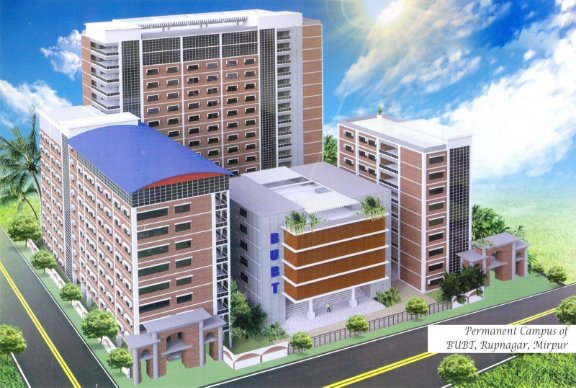

Figure 1.1: Bangladesh University of Business and Technology 

1. **Conceptual Perspective** 

In 1997 the Joint Information Systems Committee (JISC) commissioned a Study of the archival records of British universities (Elizabeth Parker and Christine Smith, Oct 1997). The study found (p.15) that the greatest volume of institutional records deposited in university archives, in equal quantities to governance records, was student records. This report thus brought into 

*CHAPTER 1. INTRODUCTION*  3 ![ref1]

focus  the  huge  storage  implications  for  all  universities,  including  King’s  College,  which traditionally has taken the paper “student record” into its archives for permanent retention.[**?**] 

Accord  to  king’s  college  explained  that  “student  record”  was  identified  as  particularly containing a vast array of materials with large variation between Schools as to what was being held. The Archives and Corporate Records Services (ACRS) undertook preliminary costings associated with various options for retention and media conversion and it was evident that the current general practice of retaining all documentation was not sustainable. 3. A working group was then established (in early 2003) to determine whether it would be possible to control costs associated with archiving through an evaluation of what should be kept. The working group tentatively identified the core information which should be kept, but agreed that a thorough survey was required to support its conclusions.[5] 

According to (Sauer 1993 ) argued that some people will see them as an expense, others as a solution, a control mechanism, a threat to the quality of working life or even as a technical problem  in  1993.  The  diverse  perceptions  of  the  Information  system  resulted  in  a  huge differences in the definitions of IS that are available. Lucas (1995) describes an information system as helping to control operations in an organization, whilst Laudon Laudon (2002) defines it technically as a set of interrelated components that collect (or retrieve), process, store, and distribute information to support decision making, coordination, and control in an organization. Information systems are seen as a strategic resource within the organization, that is, they have an important impact on key operations which determine the livelihood of the organization  (Martin,  1992).  Student  information  system  literally  means  the  general information systems for maintaining and providing student information. It exists in all the schools,  colleges,  universities  and  any  other  education  institutions.  However,  those information systems vary. Some of them are paper based; heavily manual work is involved in managing  and  maintaining  information  such  as  student  personal  records  files.  However, recently, most schools, even down to the very smallest, utilize computers in some way or another.  The  uses  to  which  the  computers  are  put  vary  enormously,  ranging  from  word processing and spreadsheet through to worldwide on-line access, complicated user access permission system and vast functionalities.[6] According Safarzade Mansoori; (2009) student 

*CHAPTER 1. INTRODUCTION*  4 ![ref1]

record management system refers to as the assembly of several subsystems based on the databases  in  the  organization.  These  subsystems  range  from  data  collection,  transaction processing and validating, processing, analyzing and storing the information in databases. MIS is a system which receives data from different units and produces information and provides managers in all levels with relative, just-in-time, precise and uniform information for decision- making and MohdEhmer Khan and Farmeena Khan; (2011) (Information and Knowledge and Management www.iiste.org ISSN 2224-5758 (Paper) ISSN 2224-896X (Online) Vol 1, No.2 ) defined management information system as an integrated, uniform method for collecting and reporting information about a particular program, event or activity. According to King’s college London (2006 ) defined Student Records as a based service that allows students to manage their personal information, academic and administrative staff to view student information and perform student 

administration tasks.[7] 

2. **Theoretical Perspective** 

According to Jonelle (2002) noted that management information system is vital in assisting executives and the general workforce in performing any tasks related to the processing of information  and  Satyanaraya  (2009)  said  that  ,  management  information  system  in maintenance student records in university helps to provide accurate and timely information necessary to facilitate the decision-making process and enable the organizations planning, control, and operational functions to be carried out effectively.[8] 

3. **Contextual perspective** 

Student  records  management  system  (SRMS)  is  basically  concerned  with  the  process  of collecting,  processing,  storing  and  transmitting  relevant  information  to  support  the management operations in any organizations. it is “the application of systematic and scientific control to all the recorded information that a University needs to do business. Poor record management results in difficulties in administering, planning and monitoring an education 

*CHAPTER 1. INTRODUCTION*  5 ![ref1]

system. In fact, poor records management and the lack of staff development along the entire information cycle are responsible for problems with management and policy implementation in University.[9] 

Although  different  methods  or  systems  can  be  used  to  bring  about  efficient  records management,  there  are  some  basic  rules  that  must  be  respected.  So  as  to  manage  any information  well,  it  is  vital  initially  to  determine  its  characteristics  and  functions.  This  is important, because the way in which records (which contain the information) are arranged depends on the type of information they contain. 

3. **Statement of the Problem** 

Management student Record system (MSRS) is the process of collecting, processing, and storing transmitting relevant information to support the management operations in any organizations. Where it helps to provide accurate and timely information necessary to facilitate the decision- making process and enable the organizations planning, control, and operational functions to be carried out effectively. However, at Bangladesh University of Business and Technology has technology,  but  accessing  Students  records  in  Bangladesh  University  of  Business  and Technology has always been problematic for example Cases of delayed marks, incorrect grades, delays in issuing academic awards have all been too common therefore findings will reveal poor records management as the biggest problem facing Universities especially BUBT.[4] 

1. **Purpose of the Study** 

The purpose of the study is to establish the impact of management information system on maintenance of student records in University. [7] 

2. **General Objective** 

To develop student information system to overcome the problem of paper work in the university as stated above.[10] 

*CHAPTER 1. INTRODUCTION*  6 ![ref1]

3. **Objectives of the study** 

The study will base on the following objectives; 

i. Impact of computerized data collection on maintenance of student records in BUBT. ii. Impact of computerized information protection (MIS) on maintenance student records. iii. Impact of computerized records management (MIS) on maintenance of student records’. 

4. **The Scope of the Study** 

The proposed system is intended to manage specific information of students such as personal details, course details, faculty details, department details and exam details etc. It is not Student Information Management System which has a broader application. It is only a part of Student Information Management System. 

This  project/research  when  completed  will  provide  comprehensive  Student  information System for Academic department of BUBT. The system should be able to capture, validate, sort, classify, calculate, summarize, store, retrieve, reproduce and communicate operational data. Student information System will store semester details, course details, department details and all the details of students including their background information, educational qualifications and personal details etc. 

The proposed system will have the following features: 

Login module: Login module will help in authentication of user accounts. Users who have valid login id and password can only login into their respective accounts; 

Search  module:  This  model  allows  one  to  search  for  a  Particular  student  or  group  of students using search criteria such as name of student, Index number, course code among others; 

*CHAPTER 1. INTRODUCTION*  7 ![ref1]

Registration  Module  and  Account  Management:  This  module  will  help  the  student  get registered from anywhere if internet is present .This module will really simplify the task of the manual registration. 

User Management: This module will help the registrar in enabling/disabling a user. 

5. **Significance of the Study** 

The findings on impact of management information system in maintenance of student records would help to provide; accurate and on timely information to the student instead of taking time to sort/ crosschecking in papers by the registrar, it helps Academic registrar to deliver the information to the student on line without frequently visiting in his/ her office to access the information hence the Significance of the study. 

4. **Definition of Operational Terms** 

Student information system literally means the general information systems for maintaining and providing student information. It exists in all the schools, colleges, universities and any other  education institutions. However,  those information  systems  vary.  Some  of  them  are paper based; heavily manual work is involved in managing and maintaining information such as student personal records files. However, recently, most schools, even down to the very smallest, utilize computers in some way or another. The uses to which the computers are put vary enormously, ranging from word processing and spreadsheet through to worldwide on- line access, complicated user access permission system and vast functionalities. SRMS can be defined as a system providing management with accurate and timely information necessary to facilitate  the  decision-making  process  and enable  the  organizations  planning,  control,  and operational functions to be carried out effectively. Student Records as a based service that allows students to manage their personal information, academic and administrative staff to view student information and perform student administration tasks. 

**Chapter 2**

**Existing Literature** 

1. **Introduction** 

This  chapter  presented/outlined  the  sections  in  this  chapter  that  is  to  say  Introduction, Theoretical underpinning of the study, and literature review of computerized data collection and student record, information protection and on student records, and record management on the student records. 

This section presents a review of related literature to the study of management information system  and  student  records:  the  review  has  been  done  in  accordance  with  the  research objectives which are impact of computerized data collection on maintenance of student record, computerized  information  protection  on  student  record  and  computerized  record management in maintenance of student records in Bangladesh University of Business and Technology. 

2. **Theoretical Under-pinning of the Study.**

According to the university of Florida (2012) explained that a student is an individual who is registered  for  a  university  credit  course  or  program.  A  student  record,  also  known  as  an education record, contains information directly related to a student, which means that the record is personally identifiable. Personal identifiers that relate a record to a student include student name, student ID/social security number, student address, parent/family member 

8 

*CHAPTER 2. EXISTING LITERATURE*  9 ![ref1]

names, and a list of personal characteristics. Student records are Maintained in multiple media including handwriting, print, computer’s main memory, magnetic tape, cassette, disk or CD. Student records may be presented by the student, submitted on behalf  of the student, or created by the University. These records are used to assist offices in their support of basic institutional objectives and to document student progress and achievement in the educational process of the University. 

1. **Computerized Data Collection on Maintenance of Student Records** 

According to Sharapova (2014) noted that systematic literature review was employed as follows: 

1) A variety of combinations of search strings were applied to selected scientific databases and  search  engines.  The  search  string  matrix  was  developing  continually  throughout  the review 

process. 

2) Papers pre-selected on the basis of their title and abstract were downloaded to the citation manager, together with their full text. 
2) All duplicates, multiple entries and irrelevant papers were removed; remaining papers were scanned for the information of interest. 
2) When  a  relevant  document  was  cited  that  had  not  been  previously  identified  by database queries, it was downloaded. 
2. **Computerized Information Protection on Student Record.**

According to kyobe, South African university (2009) explained that computerized Information security  issues  (e.g.  access  to  information,  cyber-crime,  privacy,  and  virus  Attacks,  and commercial data mining) are of major concern in academia today Myler and Broadbent (2006). According  to  Wamukoya  and  Mutual  (2005)  noted  that  poor  security  and  confidentiality 

*CHAPTER 2. EXISTING LITERATURE*  10 ![ref1]

controls have been identified as major factors contributing to the failure of capturing and preservation of electronic records in eastern and southern African institutions of education. 

However, little protection of the information of student records is not serious because other students access the information about other students or colleagues without permission hence the need for proper protection for the student records well. 

3. **Computerized Record/Data Management on Maintenance of Student Record** 

According to student records manual prepared by University of South Florida (office of the registrar) the creation and maintenance of records relating to the students of an institution are essential to: 

Managing the relationship between the institution and the student; 

Providing support and other services and facilities to the student; 

Controlling the student’s academic progress and measuring their achievement, both at the institution and subsequently; 

Providing support to the student after they leave the institution. In addition, student records contain  data  which  the  institution  can  aggregate  and  analyze  to  inform  future  strategy, planning and service provision. A student is an individual who is registered for university credit course or program. A student record/data contains information directly related to a student, which means that the record is personally identifiable. Personal identifiers that relate record to a student include student name, student ID, student address, parent/family member names, and a list of personal characteristics. Student records could be maintained in multiple media including  handwriting,  print,  microfilm/fiche,  computer’s  main  memory,  magnetic  tape, cassette, disk or diskette. Student records/data may be presented by the student, submitted on behalf of the student, or created by the University. These records are used to assist offices in their  support  of  basic  institutional  objectives  and  to  document  student  progress  and achievement in the educational process of the University. Educational institutions and agencies are required to conform to fair information practices. This means that persons who are subjects of data systems (i.e., students at an institution) must: 

*CHAPTER 2. EXISTING LITERATURE*  11 ![ref1]

Be informed of the existence of such systems 

Have identified for them what data about them are on record, 

Be given assurances that such data are used only for intended purposes 

Be given the opportunity to request an amendment or correction to their record and Be certain that those responsible for data systems take reasonable precautions to prevent misuse of the data. 

According to Allen (1989) analyzed some studies undertaken to analyze patron’s response to using bibliographic databases on CD-ROM in academic libraries and found that patrons prefer CD-ROM  to  comparable  printed  reference  tools.  Lombardo  and  Condic  (2000)  set  out  to determine user acceptance of the On-line Public Access Catalogue (OPAC) and found that users overwhelmingly preferred the OPAC and found it easy to use. Similarly, Isman (2004) found that students in Eastern Mediterranean University have very positive attitude towards Internet use; just as Allen (1997) found that the students surveyed were receptive towards electronic information resources while the internet was their most used of these resources available to them.  Even  Idowu  (1997)  found  that  the  Nigerian  university  librarians  have  a  positive disposition  towards  the  computerized  systems.  On  the  other  hand  computerized  records management may be defined as that part of records management that deals with records in electronic form. According to Johnston and Bowen (2005) computerized record management includes ’the creation, use, maintenance and disposal of electronically created records for the purposes  of  providing  evidence  of  business  activities’.  Archivists’  emphasis  that  the  term ’record’ does not simply refer to a collection of data, but to a product or an event. It is a specific type  of  information  reflecting  and  providing  evidence  of  business  processes  or  individual activities (Bantin 2001) On the other hand according to Scottish Government of Scotland(2008) noted that computerized records management is the process of managing records throughout their  life  cycle,  from  their  creation,  usage,  maintenance  and  storage  to  their  ultimate destruction  or  permanent  preservation.  According  to  Muhenda  (2000)  Proper  records management underpins policy formulation, decision making, protects interests of organization, and  protects  rights  of  employers  and  students  in  addition  to  helping  Institutions  conduct business and deliver services in a consistent and equitable manner. Little is yet known about 

*CHAPTER 2. EXISTING LITERATURE*  12 ![ref1]

the  management  of  computerized  records  management  and  compliance  with  electronic communication regulations by academics and students in Bangladesh University of Business and Technology. 

4. **Problem Definition** 

i-Less human error ii-Strength and strain of registers and papers can be reduced iii-High security iv-Data consistency v-Easy to handle vi-Easy data updating vii-Easy record keeping viii-Backup data can be easily generated 

5. **Summary / Conclusion** 

Finally,  since  the  data  generated  in  day  to  day  transactions  by  School  of  information Technology. Formal according to the registrar, it is worthwhile and full to develop strong student information management system for the school to hold the large amount of data that is generated. The proposed system, SIMS, should be able to stand the test of time because student records should be kept as long as is necessary to: 

- Fulfill and discharge the contractual obligations established between the institution and the student, including the completion of any non-academic disciplinary action; 
- Provides  information  on  the  academic  career  and  achievements  of  the  student  to employers, licensing/regulatory bodies and other organizations, as well as to the student as part of their lifelong learning record. The information gathered whilst reviewing existing. 

Literature  on  student  information  management  system  has  been  very  useful  in  the development of the proposed system. The project when completed will provide an efficient way to store and organize data than spreadsheet. It will also serve as a centralized facility that can 

*CHAPTER 2. EXISTING LITERATURE*  13 ![ref1]

easily be modified and quickly shared among multiple users. The proposed system will have a well-designed interface that allows users to interact with the system. Therefore the study from different countries and nations explained management information system on student record has helped in improving and providing efficient information and timely to the information needed to all the student and administration and when comes to Bangladesh University of Business  and  Technology  has  always  been  problematic  for  example  Cases  of  lost  marks, incorrect  grades,  delays  in  issuing  academic  awards  have  all  been  too  common  therefore findings  will  reveal  poor  records  management  as  the  biggest  problem  facing  Universities especially BUBT. 

**Chapter 3 proposed model** 

1. **Introduction** 

This chapter presents the methodology that the study employed and they included Research design, Population of the study, Sample size, Sampling methods, Data collections method, the procedure of the study, Data analysis, Limitation of the study, and ethical issue that are under the consideration. 

2. **Research Design** 

The study will be a case study design and descriptive design in which both quantitative and qualitative  approaches  will  be  used.  Descriptive  design  will  be  used  to  describe  the phenomenon. Therefore, since the present study seeks to describe the impact of management information system on maintenance of student records in universities, descriptive design will be appropriate for the study , and this will involve the examination of available documents, conducting interviews, observation of the current system, and administering questionnaires to different categories of the people as shown in the sample size. Examination documents and research will be carried out for clarity and verification of facts to be collected and information about existing systems an associated problems avenue like reference books, journals and the internet. 

14 

*CHAPTER 3. PROPOSED MODEL*  15 ![ref1]

Figure 3.1: Search Data 

Figure 3.2: Delete Data 

Figure 3.3: Update Data 

*CHAPTER 3. PROPOSED MODEL*  16 ![ref1]

Figure 3.4: Change Password 

3. **Sampling Method** 

The  study  used  sampling  techniques  which  include  cluster  sampling  that  will  be  used  in collection of the information from the lecturers, systematic probabilistic method where the list of different respondents will be selected for example non-teaching administrators, student leaders  and  purposive  non  probabilistic  method  will  also  be  used in  the  collection  of  the information  where  the  selected  people  or  respondents  will  be  selected  such  as  top administrator, because these are the people who will be having the information needed in the research (people controlling and managing the information) 

4. **Limitation of the Study** 

The study was affected with many problems like delay to respond to the letter of introduction of the researcher, delay to fill the questionnaires, hard to meet the top management people due to busy schedules, hard for the respondents to give right information due to fear to lose their jobs and among others. The study has a problem of the new staffs who were still learning what happens at the university hence the information expected was not the exact information given hence affected the study of the research the data will involve the non-teaching staff were by the time of research may have recruited new administrators will not be having the information needed in research hence a limitation to the study. 

*CHAPTER 3. PROPOSED MODEL*  17 ![ref1]

5. **Ethical consideration** 

The study will observe the security consent of the respondents, have freedom to move out for exercise without crush, and names of identity will not be disclosed, and also there will be no use of personal opinion and harming of respondents will not exist, therefore the study will be strictly for academic purposes only. 

6. **Benefits of the proposed system** 
1. There  shall  no  confusion  and  misallocation  of  resources  since  the  system enforces standardsand security. 
1. Student records are now easy to retrieve and update hence saving timeiii. Efficiency will be achieved of minimized data loss. 
7. **Feature Details** 

i-Adding Student Information ii-Search Data iii-Receive Data from user iv-Update Data v-Delete Data vi-Change Password 

8. **Add Student Information** 

Name. ID Intake Dept. 

*CHAPTER 3. PROPOSED MODEL*  18 ![ref1]

Father’s name Mother’s name Date of Birth Address 

9. **Advantages** 

i-Facilitates planning ii-Minimizes Information Overload iii-Encourages Decentralization iv-Brings Co-ordination. v-Makes control easier. vi-Assembles, processes, stores, retrieves, evaluates, disseminates, the Information. 

**Chapter 4 System Analysis** 

1. **Introduction** 

It is a process of collecting and interpreting facts, identifying the problems, and decomposition of a system into its components. 

System analysis is conducted for the purpose of studying a system or its parts in order to identify its objectives. It is a problem solving technique that improves the system and ensures that all the components of the system work efficiently to accomplish their purpose. Analysis specifies what the system should do. 

This chapter deals with the presentation and interpretation of the findings of the study which done in relation to the reviewed literature and regards to specific objectives. 

2. **Objectives** 
1. Impact  of  computerized  data  collection  on  maintenance  of  student  records  in BangladeshUniversity of Business and Technology. 
1. Impact of computerized information protection (MIS) on maintenance student records .iii. Impact of computerized records management (MIS) on maintenance of student records’. The findings are presented with the help of tables for purposes of easier understanding, clarity and interpretation. 

19 

*CHAPTER 4. SYSTEM ANALYSIS*  20

3. **Data Analysis** 

The study will use both quantitative and qualitative techniques, therefore the thematic data will be carried out due to the interview, editing of the information and the information will be in theme formats out of the information collected. The quantitative technique will use the descriptive method where there will be the calculation of the mean, modes, modes, median variance and standard deviations that will help to determine the statistics in the collection of the information. 

4. **Background information or Biographical Data** 

The analysis of data, interpretation was analyzed by SPSS software that stands for Statistical package for the Social Sciences (SPSS), therefore I preferred SPSS because of the advantages even  though  ,it  has  disadvantages  such  as  menu,  syntax  and  terminology  differ  across applications,  much  more  functionality  than  one  typically  requires,  and  lag  between  new versions and existing documentation, therefore the advantages overweighs the dis advantages hence the choice and the following are the advantages of SPSS. 

- It reduce/eliminate errors in calculationo It helps in data 

management such as add variables and observations, recode variables and 

among others. 

- Its graphic utilitieso It is faster, more efficient o It allows multiple 

users to work with the same data file. 

*CHAPTER 4. SYSTEM ANALYSIS*  21

5. **How the System Works** 

The student process was operating manually with a registration form, which is filled by the potential resident and handed into the registrar. The registrar then receives the hard copies of the documents of the student and keeps only the hard copies without scanning them and have the soft copies. The registrar records the documents and keeps it for further references. 

6. **Security Requirements:**

We are going to develop a secured database. There are various categories of people namely Administrator, Student who will be viewing either all or some specific information from the database. Depending upon the category of user the access rights are decided. It means if the user is an administrator then he/she can be able to modify the data, append etc. All other users only have the rights to retrieve the information about database. 

7. **Software Requirements: (minimum Requirement)** 

Operating system: Windows 2000/2008 / 2010 / 

NT/ XP/ Vista 

Analyzing Software: Code blocks etc. Compiler : Standard C Compiler 

Data Composer : Microsoft office program 

8. **Hardware Requirements :(Minimum Requirement)** 

Minimum RAM: - 1GB or more 

Hard Disk: - 40 GB or more 

*CHAPTER 4. SYSTEM ANALYSIS*  22

Processor: - Intel Pentium 3 or above 

**Chapter 5 Result Section** 

1. **Introduction** 

This chapter deals with the presentation and interpretation of the findings of the study which done in relation to the reviewed literature and regards to specific objectives. 

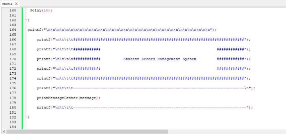

Figure 5.1: Student Record Management System 

23 

*CHAPTER 5. RESULT SECTION*  23 ![ref1]

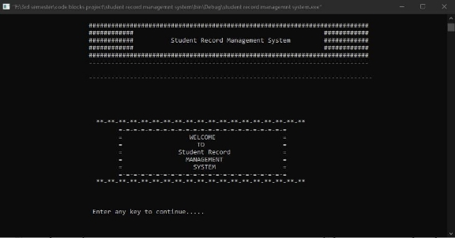

Figure 5.2: Student Record Management System 

2. **User login** 

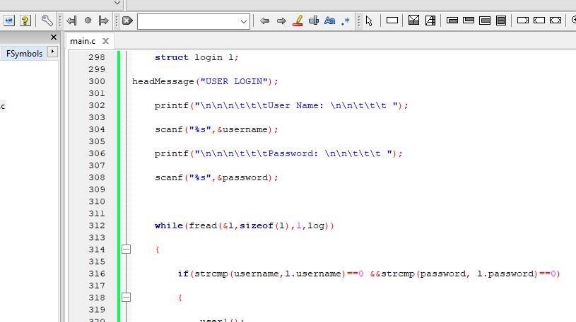

Figure 5.3: user login:1 

*CHAPTER 5. RESULT SECTION*  24 ![ref1]

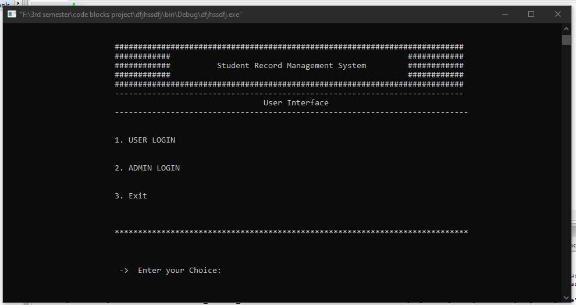

Figure 5.4: user login:2 

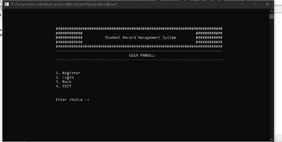

Figure 5.5: Register:1 

*CHAPTER 5. RESULT SECTION*  25 ![ref1]

3. **Adminlogin** 

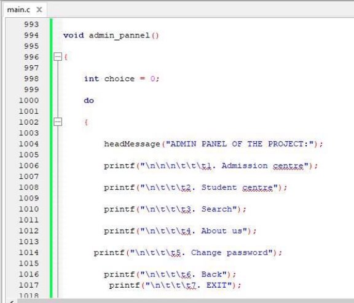

Figure 5.6: admin pannel:1 

*CHAPTER 5. RESULT SECTION*  26 ![ref1]

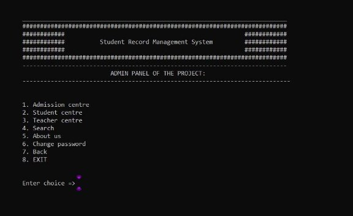

Figure 5.7: admin pannel:2 

*CHAPTER 5. RESULT SECTION*  27 ![ref1]

Figure  5.8:  Admission  Centre  Figure 5.9: Admission Centre:2 

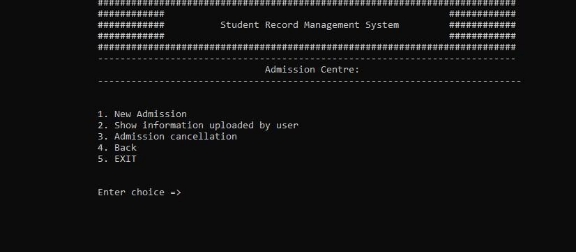

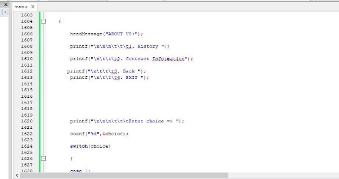

Figure 5.10: About us 

*CHAPTER 5. RESULT SECTION*  28 ![ref1]

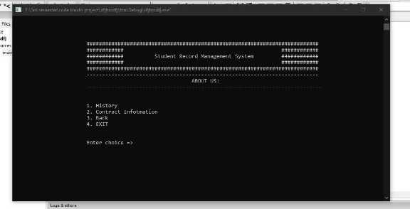

Figure 5.11: About us:2 

29 

**Chapter 6**

**CONCLUSION AND RECOMMENDATION** 

1. **Introduction** 

This chapter presents the discussion of findings, conclusions, and recommendations arising from the study objectives which where; to improve on data collection, information protection, improve on records management (MIS) on maintenance of student records’. At the end of the discussion are the conclusions about the study and finally, the recommendations for further research. 

2. **Discussions of the Findings** 

Under this section, a number of studies are presented that are either in support of the findings or are contrary to the findings. This has helped in arriving at the conclusion of the study. 

The discussions are presented below under each objective. 

30 

*CHAPTER 6.  CONCLUSION AND RECOMMENDATION![ref1]*

3. **Conclusion** 

From the findings and the discussion, the study makes the following conclusions: 

For objective one, the researcher comes to the conclusion there is need to improve on the data collection since the university is using manual system of working one per one student that consumes time. 

Secondly,  the  researcher  came  to  the  conclusion  that  the  student  records  needs  to  be identified differently for easy retrieval and accessibility for improvement on the transparency. From  the  analysis  of  the  research  (interviews  and  questionnaire),  it  evident  that  student records are kept with only one person (registrar) where the rest of the management are not sure how the information is protected and identified, therefore there’s need for transparency and sharing of the passwords for better management of the records especially when one person disappears. This “Student Record Management System” project will serve as a useful approach to data base dialog system providing 

Great security options 

Helpful approach for the users 

Reduces the time User 

friendly approach 

Reduce human error. 

**Bibliography** 

1. Iuon-Chang Lin and Tzu-Chun Liao. A survey of blockchain security issues and challenges. *International Journal of Network Security*, 19(5):653–659, Sept, 2017. 
1. J. Clark A. Narayanan J. A.Kroll J. Bonneau, A. Miller and E. W. Felten. “research perspectives and challenges for bitcoin and cryptocurrencie”. *IEEE Symposium on Security and Privacy*, pages 104–121, May, 2015. 
1. A.  Kiayias  J.  Garay  and  N.  Leonardos.  “the  bit-coin  backbone  protocol:  Analysis  and applications”. *Springer Berlin Heidelberg*, pages 281–310, 2015. 

31 

4. AnubhavUjjawal.  “how  does  the  blockchain  work?”. *https://www.geeksforgeeks.org/howdoes-the-blockchain-work/*, 2016. 
4. Xiaojiang Du Jun Wang Yi Zhuang Ziwang Wang Jingjing Gu, Binglin Sun. “consortium blockchain-based malware detection in mobile devices”. *IEEE*, 6:12118–12128, 2018. 
4. Kristjan Koˇsiˇc Marjan Heriˇcko Aida Kamiˇsali´c Muhamed Turkanovi´c, Marko H¨olbl. “ a blockchain-based higher education credit platform”. *IEEE*, 6:5112–5127, 2018. 
4. Zengxiang Li Mingzhong Xiao Quanqing Xu, Zhaozheng He. “ building an ethereum-based decentralized smart home system”. *IEEE*, 24:1004–1009, 2018. 
4. Tsung-Ting Kuo Hyeon-Eui Kim Lucila Ohno-Machado. “ blockchain distributed ledger technologies for biomedical and health care applications”. *American Medical Informatics Association*, 24:1211–1220, 2017. 

32 

*BIBLIOGRAPHY*

9. Ms.  Priyanka  Wankar  Ms.  Sonali.  B.  Maind.  “  basic  of  artificial  neural  network”. *International Journal on Recent and Innovation Trends in Computing and Communication*, 2:96 – 100, 2016. 
9. Yu Nandar Aung ; Thitinan Tantidham. “ review of ethereum: Smart home case study”. *IEEE*, 2018. 

[ref1]: Aspose.Words.7909d900-de85-4347-a517-ba6b16368134.002.png
